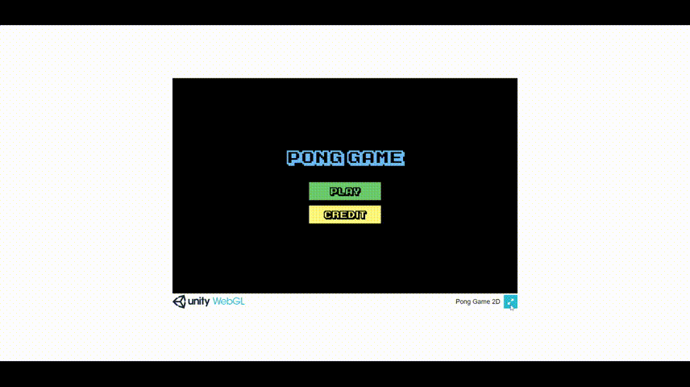

Pong Game 2D
===
This repository contains 2D Game Pong unity files which are used for independent exercises provided by Agate Studio in the DTS FGA - Game Programming training in collaboration with Digitalent Kominfo (Kementerian Komunikasi dan Informatika / Ministry of Communication and Information) Republic of Indonesia.

## Papar Information
- Title:  `Pong Game 2D`
- Author:  [`Manuel Setyo Saputro Sriwibowo`](https://github.com/msetyo15)
- Types: `Pong`, `2D`, `Unity`, `Game`
- Files: [view](https://github.com/msetyo15/Pong-Game-2D)
- Demo Program: [view](https://msetyo15.github.io/Pong-Game-2D/)

## Game Rules
- The player who gets 5 scores first wins
- A number of players 2 people
- ### Items:
  - Ball Speed
  - Duplicate Ball
  - Paddle Speed
  - Extend Paddle


## Preview


## Install & Dependence
- text editor (`recommendation: "Visual Studio 2019"`, VSCode, Sublime, etc)
- unity

## Dataset Preparation
| Dataset | Download |
| ---     | ---   |
| Font Karmatic Arcade | [download](https://www.dafont.com/karmatic-arcade.font) |
| Logo | [download](https://is2-ssl.mzstatic.com/image/thumb/Purple118/v4/c3/e7/23/c3e723a9-af96-6b45-55e1-76d38ab83c52/AppIcon-0-1x_U007emarketing-0-0-GLES2_U002c0-512MB-sRGB-0-0-0-85-220-0-0-0-4.png/1080x0w.webp) |


## Directory Hierarchy
```
|—— .gitattributes
|—— .gitignore
|—— Assets
|    |—— Animation
|        |—— FloatGoal.anim
|        |—— FloatGoal.controller
|        |—— FloatGoal2.controller
|        |—— FloatGoal_2.anim
|        |—— FloatSpeedUp.controller
|        |—— FloatText.anim
|        |—— LinkButton.anim
|        |—— LinkButton.controller
|    |—— Font
|        |—— Karmatic-Arcade.ttf
|    |—— Material
|        |—— Bounce With Friction.physicsMaterial2D
|        |—— Bounce.physicsMaterial2D
|    |—— Prefabs
|        |—— FloatParentGoal.prefab
|    |—— Resources
|        |—— pong.jpg
|        |—— preview.gif
|    |—— Scenes
|        |—— Game.unity
|        |—— MainMenu.unity
|    |—— Scripts
|        |—— BallController.cs
|        |—— BallDuplicate.cs
|        |—— FloatSpeedUp.cs
|        |—— GameManager.cs
|        |—— GoalController.cs
|        |—— MainMenuController.cs
|        |—— PaddleController.cs
|        |—— PanelConroller.cs
|        |—— PowerUpManager.cs
|        |—— PULongUpPaddle.cs
|        |—— PUSpeedUpController.cs
|        |—— PUSpeedUpPaddle.cs
|        |—— ScoreController.cs
|        |—— ScoreManager.cs
|—— Packages
|    |—— manifest.json
|    |—— packages-lock.json
|—— ProjectSettings
|    |—— AudioManager.asset
|    |—— ClusterInputManager.asset
|    |—— DynamicsManager.asset
|    |—— EditorBuildSettings.asset
|    |—— EditorSettings.asset
|    |—— GraphicsSettings.asset
|    |—— InputManager.asset
|    |—— NavMeshAreas.asset
|    |—— PackageManagerSettings.asset
|    |—— Physics2DSettings.asset
|    |—— PresetManager.asset
|    |—— ProjectSettings.asset
|    |—— ProjectVersion.txt
|    |—— QualitySettings.asset
|    |—— TagManager.asset
|    |—— TimeManager.asset
|    |—— UnityConnectSettings.asset
|    |—— VersionControlSettings.asset
|    |—— VFXManager.asset
|    |—— XRSettings.asset
|—— README.md
```
## Code Details
### Tested Platform
- software
  ```
  OS: Microsoft Windows 10 Pro (Build 19044)
  Visual Studio 2019: 16.11
  Unity: 2020.3.28f1
  ```
- hardware
  ```
  CPU: AMD Ryzen 3 2200G
  GPU: Radeon Vega Graphics
  ```